# Component Diagram — AI-Agent OOP 2026

> Thể hiện ranh giới layer, chiều dependency hợp lệ và các dependency bị cấm.

```mermaid
graph TD
    subgraph EntryPoints["Entry Points"]
        EP1[main.cpp / OopAgent]
        EP2[benchmark/run_eval.cpp]
        EP3[benchmark/test_multi_agent.cpp]
        EP4[benchmark/demo_multi_agent.cpp]
    end

    subgraph AgentCore["Agent Core  (src/agent/, src/client/, skills/)"]
        AC1[AgentLoop]
        AC2[LLMClient\n«interface»]
        AC3[OllamaClient]
        AC4[GeminiClient]
        AC5[SkillLoader]
        AC6[LoopDetector]
        AC7[StepHook\n«std::function»]
        AC3 -->|implements| AC2
        AC4 -->|implements| AC2
        AC1 -->|uses| AC2
        AC1 -->|uses| AC5
        AC1 -->|owns| AC6
        AC1 -->|emits via| AC7
    end

    subgraph ToolsLayer["Tools  (src/tools/)"]
        TL1[Tool\n«interface»]
        TL2[ToolRegistry]
        TL3[CalculatorTool]
        TL4[FileTool]
        TL5[ExecTool]
        TL6[WebSearchTool]
        TL7[MemoryTool]
        TL8[TimeTool]
        TL9[JsonTool]
        TL10[GitTool]
        TL3 & TL4 & TL5 & TL6 & TL7 & TL8 & TL9 & TL10 -->|implements| TL1
        TL2 -->|owns unique_ptr| TL1
    end

    subgraph EnvLayer["Environment  (src/environment/)"]
        EV1[Environment\n«interface»]
        EV2[NativeEnvironment]
        EV3[SandboxEnvironment]
        EV2 & EV3 -->|implements| EV1
    end

    subgraph HarnessLayer["Harness / Evaluator  (src/harness/, benchmark/)"]
        HL1[HarnessRunner]
        HL2[Evaluator\n«interface»]
        HL3[KeywordEvaluator]
        HL4[FunctionalEvaluator]
        HL5[VLMEvaluator\n«skeleton»]
        HL3 & HL4 & HL5 -->|implements| HL2
        HL1 -->|owns unique_ptr| HL2
        HL1 -->|uses via interface| EV1
        HL1 -->|non-owning ptr| AC1
        HL1 -->|receives via| AC7
    end

    subgraph MultiAgentLayer["Multi-agent  (src/multiagent/)"]
        MA1[MultiAgentRunner]
        MA2[MessageQueue]
        MA3[AgentMessage]
        MA1 -->|owns| MA2
        MA2 -->|contains| MA3
        MA1 -->|spawns| AC1
    end

    subgraph ExternalDeps["External Dependencies"]
        EX1[libcurl]
        EX2[nlohmann/json]
        EX3[SQLite3]
        EX4[std::filesystem]
        EX5[std::thread / mutex / cv]
    end

    %% ── Valid top-level flows ───────────────────────
    EP1 -->|creates| AC1
    EP2 -->|creates| HL1
    EP2 -->|creates| AC1
    EP3 & EP4 -->|creates| MA1

    AC1 -->|owns| TL2
    AC3 & AC4 -->|uses| EX1
    AC3 & AC4 -->|uses| EX2
    TL7 -->|uses| EX3
    TL4 & TL5 -->|uses| EX4
    MA1 -->|uses| EX5
    EV2 -->|uses| EX4
    EV3 -->|uses| EX4

    %% ── Forbidden dependencies (shown as red notes) ─
    FORBIDDEN1["❌ AgentLoop → HarnessRunner  FORBIDDEN"]
    FORBIDDEN2["❌ Tool impl → AgentLoop  FORBIDDEN"]
    FORBIDDEN3["❌ Evaluator → AgentLoop internals  FORBIDDEN"]

    style FORBIDDEN1 fill:#ffcccc,stroke:#cc0000,color:#000
    style FORBIDDEN2 fill:#ffcccc,stroke:#cc0000,color:#000
    style FORBIDDEN3 fill:#ffcccc,stroke:#cc0000,color:#000
```



---

## Tóm tắt chiều dependency hợp lệ

```
EntryPoints
    ↓
AgentCore  ←── StepHook (callback)  ───→  HarnessLayer
    ↓                                          ↓
ToolsLayer                              EnvLayer (via interface)
                                               ↑
                                        HarnessLayer uses
```

- **AgentCore** không biết gì về HarnessLayer hay EnvLayer.
- **ToolsLayer** không biết gì về AgentCore hay HarnessLayer.
- **HarnessLayer** nhận kết quả từ AgentCore qua `StepHook` callback, không import header nội bộ của `AgentLoop`.
- **EnvLayer** là abstraction được HarnessRunner inject — `SandboxEnvironment` cho chạy benchmark cô lập, `NativeEnvironment` cho chạy thường.
- **MultiAgentLayer** tái sử dụng `AgentLoop` như thành phần con, không thay thế Harness benchmark.

## Source paths theo component

| Component | Source |
|---|---|
| AgentLoop, LoopDetector | `src/agent/agent_loop.cpp`, `src/agent/LoopDetector.cpp` |
| SkillLoader | `src/agent/SkillLoader.cpp` |
| LLMClient (interface) | `src/client/llm_client.h` |
| OllamaClient | `src/client/ollama_client.cpp` |
| GeminiClient | `src/client/gemini_client.cpp` |
| ToolRegistry | `src/tools/ToolRegistry.cpp` |
| Tool implementations | `src/tools/*.cpp` |
| Environment | `src/environment/` *(mới thêm Tuần 9)* |
| HarnessRunner | `src/harness/HarnessRunner.cpp` |
| Evaluators | `src/harness/KeywordEvaluator.cpp`, `FunctionalEvaluator.cpp`, `VLMEvaluator.cpp` |
| MultiAgentRunner | `src/multiagent/MultiAgentRunner.cpp` |
| MessageQueue | `src/multiagent/MessageQueue.h` |