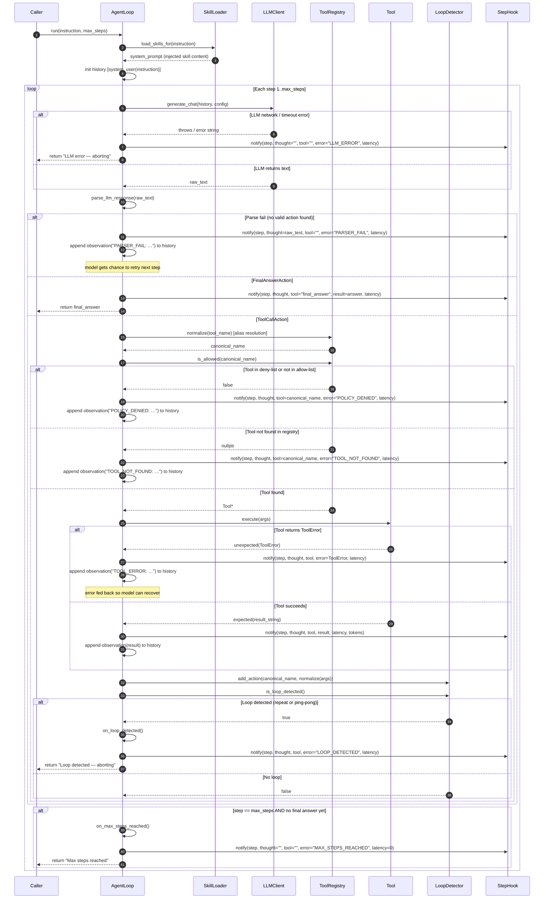

# Sequence Diagram — Agent Run

> Phản ánh luồng `AgentLoop::run()` theo ReAct pattern.  
> Bao gồm các nhánh: tool success, tool error, LLM error, parser fail, policy deny, max_steps, loop detected, final answer.

---

## Bảng nhánh và kết quả

| Nhánh | Điều kiện | Hành động | Kết quả trả về |
|---|---|---|---|
| LLM error | Network timeout / HTTP error | Notify hook, abort | `"LLM error — aborting"` |
| Parser fail | Không parse được action | Notify hook, append observation, retry | Tiếp tục step tiếp |
| Final answer | `FinalAnswerAction` | Notify hook | Answer string |
| Policy denied | Tool trong deny-list | Notify hook, append observation | Tiếp tục step tiếp |
| Tool not found | Tên không có trong registry | Notify hook, append observation | Tiếp tục step tiếp |
| Tool error | `execute()` trả `unexpected` | Notify hook, append error observation | Tiếp tục, model có thể phục hồi |
| Tool success | `execute()` trả `expected` | Notify hook, append result | Tiếp tục step tiếp |
| Loop detected | `LoopDetector::is_loop_detected()` | `on_loop_detected()`, abort | `"Loop detected — aborting"` |
| Max steps | `step == max_steps` | `on_max_steps_reached()`, abort | `"Max steps reached"` |

## Template Method — primitive operations

`AgentLoop::run()` là skeleton cố định. Các bước override được (protected virtual):

| Primitive operation | Hành vi mặc định | Subclass có thể override |
|---|---|---|
| `observe(result)` | Append observation vào history | Có thể ghi log hoặc filter |
| `think_and_act(step)` | Gọi LLM và parse | Có thể mock LLM trong test |
| `execute_tool(action)` | Lookup registry và gọi `Tool::execute` | Có thể inject test double |
| `on_loop_detected()` | Log và set abort flag | Có thể raise exception |
| `on_max_steps_reached()` | Log và set abort flag | Có thể ghi metrics |

Observer/Hook: `StepHook` là `std::function<void(TrajectoryStep)>` được truyền từ `HarnessRunner`. `AgentLoop` **không** include bất kỳ header nào của Harness.