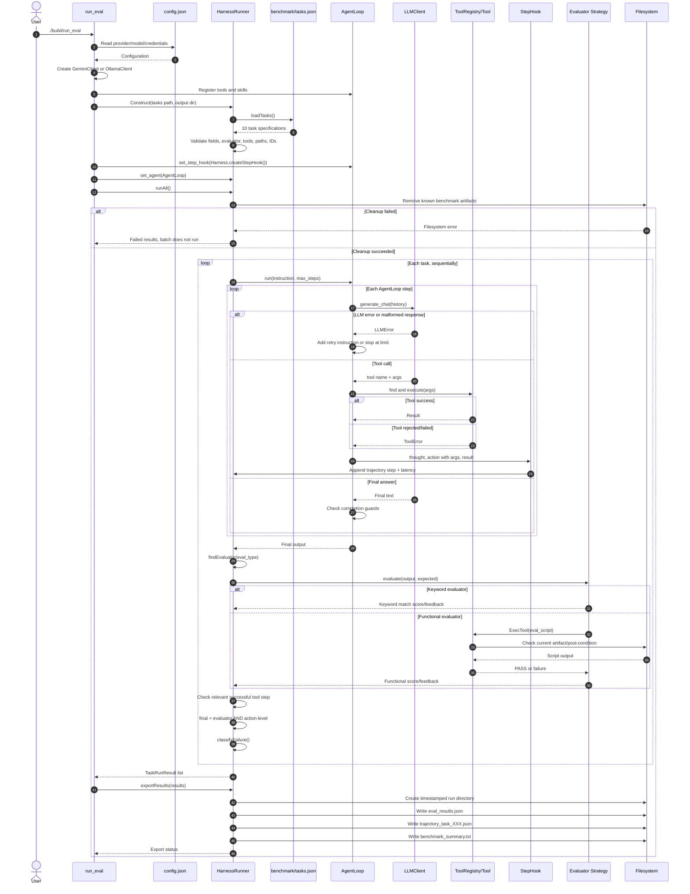
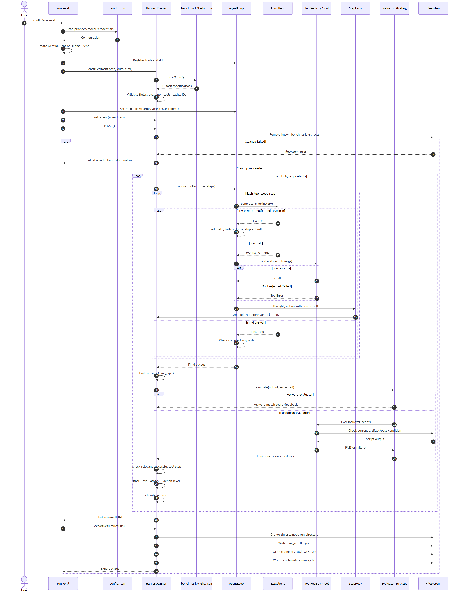

# Sequence Diagram — Batch Evaluation

The diagram below represents the current implementation of `benchmark/run_eval.cpp` and `HarnessRunner`. Cleanup runs once before the batch; the tasks then run sequentially in the same working directory.

## Verified Render

Standalone Mermaid source for reproducible rendering: [`sequence_harness.mmd`](sequence_harness.mmd).

## Verification Notes

- Strategy: `HarnessRunner` selects `KeywordEvaluator` or `FunctionalEvaluator` according to `eval_type`.
- Observer/Hook: `AgentLoop` only invokes a callback; it neither includes nor depends on `HarnessRunner`.
- Tool arguments are packaged in the JSON action before being sent through the hook.
- The hook currently records tool steps only. The LLM's final answer does not have a separate trajectory step.
- `tokens_used` is currently set to `0`, which means it has not been measured.
- If a tool does not exist, `AgentLoop` adds the error to the history so the model can retry; the current code does not invoke the hook on the tool-not-found path.
- `runAll()` waits three seconds between tasks to reduce rate-limit pressure.

## Remaining Tests

`benchmark/test_harness.cpp` currently covers task specifications, IDs and paths, Strategy selection, stale-artifact cleanup, tool-argument preservation, missing artifacts, content mismatches, invalid/tool/evaluator errors, required tool steps, and score aggregation.

Add the following checks after the related interfaces stabilize:

1. The harness uses an `Environment` abstraction instead of accessing the filesystem directly.
2. A cleanup failure produced by a fake environment stops the batch.
3. Rate limits, timeouts, and loop detection are classified with independent fixtures.
