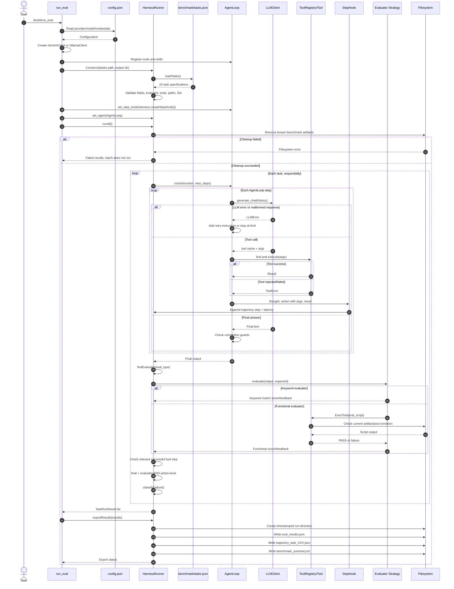

# Sequence Diagram — Batch Evaluation

Diagram dưới đây mô tả code hiện tại của `benchmark/run_eval.cpp` và `HarnessRunner`. Cleanup diễn ra một lần trước batch; các task sau đó chạy tuần tự trong cùng working directory.

## Bản render đã kiểm chứng

Nguồn Mermaid độc lập để render lại: [`sequence_harness.mmd`](sequence_harness.mmd).

## Ghi chú đối chiếu

- Strategy: `HarnessRunner` chọn `KeywordEvaluator` hoặc `FunctionalEvaluator` bằng `eval_type`.
- Observer/Hook: `AgentLoop` chỉ gọi callback; nó không include hay phụ thuộc `HarnessRunner`.
- Tool args được đóng gói trong JSON action trước khi gửi qua hook.
- Hook hiện chỉ ghi tool step. Lần LLM tạo final answer chưa có trajectory step riêng.
- `tokens_used` đang được gán `0`; đây là trạng thái chưa đo.
- Nếu một tool không tồn tại, AgentLoop đưa lỗi vào history để model thử lại; code hiện không gọi hook ở nhánh tool-not-found.
- `runAll()` chờ ba giây giữa hai task để giảm áp lực rate limit.

## Điều cần kiểm thử

`benchmark/test_harness.cpp` hiện đã kiểm tra task spec/ID/path, Strategy selection, cleanup artifact cũ, bảo toàn tool args, artifact missing/content mismatch, invalid/tool/evaluator error, bắt buộc tool step và tổng hợp điểm.

Các kiểm tra còn lại sau khi interface liên quan ổn định:

1. Harness dùng `Environment` abstraction thay vì filesystem trực tiếp.
2. Cleanup failure được tạo bằng fake environment và phải dừng batch.
3. Rate limit, timeout và loop detection được phân loại bằng fixture độc lập.
